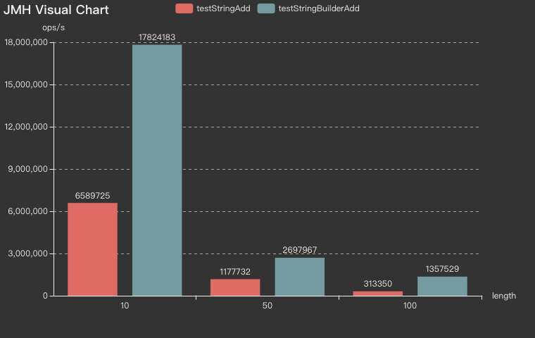
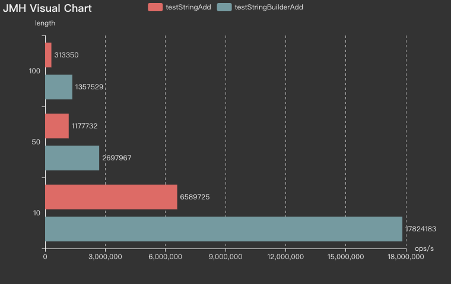
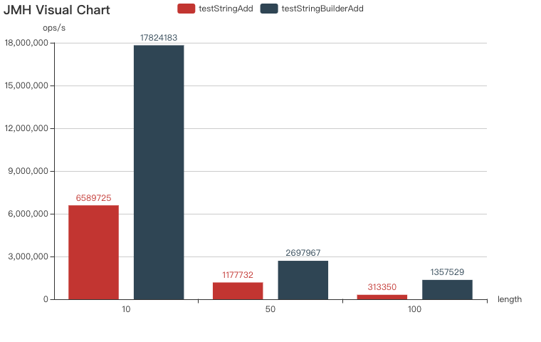

## JMH-visual-chart
基于JMH基准测试实现「一组参数不同方法维度」的可视化度量。

**一组参数不同方法维度** 是指参数在不同取值组合情况下，不同方法的基准测试结果的比较。


### QuickStart

进入[可视化页面](http://deepoove.com/jmh-visual-chart/)，支持上传JMH的JSON格式结果，可以通过以下方法获取JSON文件：
```java
Options opt = new OptionsBuilder()
  .include(MyBenchmark.class.getSimpleName())
  .result("result.json")
  .resultFormat(ResultFormatType.JSON).build();
```

上传文件后直接渲染成图表，比如在参数组合(length = 10)、(length = 50)和(length = 100)的每种取值情况下，方法`testStringAdd`和`testStringBuilderAdd`执行性能的比较图表：



支持切换横向视图和垂直视图。



页面URL后加上参数[?theme=default](http://deepoove.com/jmh-visual-chart/?theme=default)会切换成白色主题。



图表的右上角支持PNG格式图片的下载。

### Why JMH-Visual-chart
[http://jmh.morethan.io/](http://jmh.morethan.io/)是一个非常棒的JMH可视化的页面，提供了「不同方法一组参数维度」的度量。

JMH-Visual-chart目前处于实验性质，我花了几个小时实现了「一组参数不同方法维度」的度量，并且支持一些额外的功能(主题、PNG下载等)。

当有需要的时候，我会回来扩展更多 **维度** 和更多 **样式** 的图表。


### JMH
[OpenJDK Code Tools: jmh](http://openjdk.java.net/projects/code-tools/jmh/)


